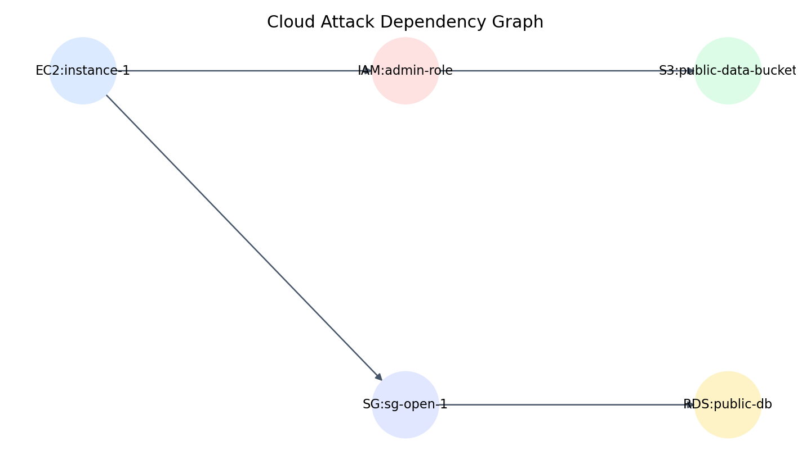

# CloudSec-Copilot

## A Context-Aware Agentic Framework for Cloud Security Posture Optimization using Attack Graphs and Verified Autonomous Remediation

---

## Executive Summary
CloudSec-Copilot is a developer-first cloud security assistant delivered as a **CLI tool and browser/IDE extension**. It combines deterministic cloud security scanning, attack graph analysis, graph-based risk prioritization, AI-assisted contextual reasoning, human-approved remediation, and automatic verification into a single workflow.

> Validation status: the project is currently validated in an AWS-compatible LocalStack environment, not against production AWS. The LocalStack setup is used for authentic, reproducible security testing of discovery, scan, fix, and verify flows.

Unlike traditional cloud security tools that stop at vulnerability reporting, CloudSec-Copilot explains the business impact of a misconfiguration, identifies the affected attack path, generates executable remediation actions, applies changes after explicit approval, and verifies that the issue has been resolved.

The system is designed for modern DevSecOps teams, cloud engineers, startups, educational labs, and security analysts who need fast, explainable, and actionable cloud security remediation without deploying a heavyweight enterprise platform.

---

# 1. Problem Statement
Cloud environments contain interconnected resources such as EC2 instances, IAM roles, S3 buckets, databases, Kubernetes clusters, and networking components. Security incidents increasingly arise from **misconfigurations** rather than software vulnerabilities. Common examples include:

- Publicly accessible S3 buckets
- Overly permissive IAM policies
- Internet-exposed databases
- Open security groups (0.0.0.0/0)
- Unencrypted storage
- Excessive service account privileges

Existing tools (Prowler, Checkov, Defender for Cloud, Wiz, Prisma Cloud) are effective at detecting these issues, but they generally require engineers to manually:

1. Interpret the finding
2. Assess the blast radius
3. Identify dependent resources
4. Decide the safest remediation
5. Write cloud commands or Terraform changes
6. Apply fixes
7. Verify remediation

This process is time-consuming, error-prone, and difficult for small teams without dedicated cloud security expertise.

### Core Problem
**How can cloud security posture management be transformed from a passive reporting process into an explainable, context-aware, semi-autonomous remediation workflow while preserving human control?**

---

# 2. Proposed Solution
CloudSec-Copilot provides a **Context-Aware Agentic Security Copilot** that performs:

- Automated cloud discovery
- Deterministic vulnerability detection
- Attack graph construction
- Graph-based risk prioritization
- AI-assisted impact analysis
- Remediation generation
- Human approval
- Automated execution
- Post-remediation verification

The tool is packaged as:

- **CLI:** `cloudsec scan`, `cloudsec fix`, `cloudsec verify`
- **IDE Extension (future):** VS Code / JetBrains integration
- **Browser Extension (future):** AWS Console contextual security assistant

---

## Demo snapshot

A minimal authentic visual for the demo is included below. It shows the dependency path the scanner and graph engine use to prioritize risk.



The project also includes a lightweight demo flow in [docs/demo_flow.md](docs/demo_flow.md) to walk through discovery, scan, fix, verify, and report.

---

# 3. Project Objectives

- Discover cloud infrastructure resources automatically
- Detect security misconfigurations using reliable rule-based analysis
- Model cloud dependencies using attack graphs
- Prioritize risks based on blast radius and privilege propagation
- Explain security findings in natural language
- Generate executable remediation commands
- Apply fixes after explicit user approval
- Verify successful remediation automatically
- Provide a lightweight developer-centric security workflow

---

# 4. System Architecture

```
Cloud APIs (AWS / LocalStack)
            │
            ▼
Infrastructure Discovery (Boto3)
            │
            ▼
Rule-Based Scanner (Prowler / Checkov Rules)
            │
            ▼
Attack Graph Builder (NetworkX)
            │
            ▼
Risk Prioritization Engine
            │
            ▼
Agentic AI Reasoning (LLM)
            │
            ▼
Remediation Planner
            │
            ▼
Human Approval Gate
            │
            ▼
Cloud Remediation Executor (Boto3)
            │
            ▼
Verification Rescan
            │
            ▼
Secure State Confirmed
```

---

# 5. Methodology

## Phase 1: Infrastructure Discovery
The CLI connects to AWS (or LocalStack for testing) and collects metadata from:

- IAM
- EC2
- Security Groups
- S3
- RDS
- VPC networking
- Cloud tags and metadata

All data is normalized into structured JSON.

## Phase 2: Deterministic Security Analysis
Security rules identify known cloud misconfigurations. This stage avoids LLM hallucinations and reduces token usage.

## Phase 3: Attack Graph Construction
Resources become graph nodes; permissions, network connectivity, and service relationships become edges. The graph enables attack-path reasoning.

## Phase 4: Graph-Based Risk Prioritization (Novel)
Each finding receives a composite score based on:

- Severity
- Internet exposure
- IAM privilege level
- Number of reachable assets
- Data sensitivity tags
- Blast radius

This prioritizes the vulnerabilities that could cause the greatest organizational damage.

## Phase 5: Agentic AI Reasoning
The LLM receives only the relevant context and generates:

- Risk explanation
- Business impact
- Attack path summary
- Remediation plan
- Executable commands
- Rollback guidance

## Phase 6: Human-in-the-Loop Approval
The user reviews proposed changes and explicitly approves execution.

## Phase 7: Automated Remediation
Boto3 applies the approved changes to cloud resources.

## Phase 8: Verification
A verification scan confirms that the vulnerability no longer exists.

---

# 6. Key Novel Contributions

## 1. Hybrid Detection + AI Reasoning
Reliable deterministic scanning detects the actual vulnerability; AI provides contextual reasoning, impact explanation, and remediation planning.

## 2. Attack Graph-Augmented AI
AI decisions are grounded in cloud dependency graphs rather than isolated findings, but the vulnerability detection itself remains deterministic and rule-based.

## 3. Graph-Based Risk Prioritization
Prioritizes vulnerabilities by blast radius instead of static severity alone.

## 4. Human-in-the-Loop Agentic Remediation
Safe semi-autonomous remediation with explicit approval.

## 5. Closed-Loop Verification
Automatic rescanning validates remediation success.

---

# 7. Comparison with Existing Solutions

| Feature | Prowler | Checkov | Defender/Wiz | CloudSec-Copilot |
| --- | --- | --- | --- | --- |
| Vulnerability Detection | ✓ | ✓ | ✓ | ✓ |
| Live Cloud Scanning | ✓ | ✗ | ✓ | ✓ |
| IaC Scanning | ✗ | ✓ | ✓ | Planned |
| Attack Graph Analysis | Limited | Limited | ✓ | ✓ |
| AI Risk Explanation | ✗ | ✗ | Partial | ✓ |
| Graph-Aware Reasoning | ✗ | ✗ | Partial | ✓ |
| Risk Prioritization by Blast Radius | Partial | ✗ | Partial | ✓ |
| Executable Remediation | ✗ | ✗ | Partial | ✓ |
| Human Approval Workflow | ✗ | ✗ | Partial | ✓ |
| Automatic Verification | ✗ | ✗ | Limited | ✓ |
| Lightweight CLI | ✓ | ✓ | ✗ | ✓ |
| Open Developer Workflow | ✓ | ✓ | ✗ | ✓ |

---

# 8. Technology Stack

| Layer | Technology |
| --- | --- |
| Language | Python 3.11+ |
| CLI | Click |
| Terminal UI | Rich |
| Cloud SDK | Boto3 |
| Graph Engine | NetworkX |
| Scanner Rules | Prowler / Checkov policies |
| AI Engine | Ollama (Llama 3 / Mistral) or Gemini API |
| Local Cloud | LocalStack |
| Containerization | Docker |
| Packaging | Poetry / pip |
| Extension Runtime | VS Code Extension API / Chrome Extension API (future) |

---

# 9. CLI User Experience

### Scan

```bash
cloudsec scan
```

### Example Output

```text
[CRITICAL] VULN-042: Public RDS Database
Blast Radius: RDS → IAM Role → S3 Production Bucket
Risk Score: 9.7/10

AI Analysis: Internet exposure combined with delete permissions on production storage could enable destructive data loss.

Fix Command: cloudsec fix --id VULN-042
```

### Remediation

```bash
cloudsec fix --id VULN-042
```

The tool displays proposed changes, waits for approval, executes them, and verifies the result.

---

# 10. Target Audience

## Primary
- DevOps Engineers
- Cloud Engineers
- DevSecOps Teams
- Startup Infrastructure Teams
- Security Analysts

## Secondary
- Educational institutions
- Cloud security training labs
- Freelance cloud consultants
- SMEs without dedicated security teams

---

# 11. Deployment Model

### MVP (Semester Project)
- Python CLI
- LocalStack support
- AWS support
- Local LLM via Ollama

### Product Version
- VS Code extension
- Browser extension
- Multi-cloud support
- Team policy packs
- CI/CD integration
- Secure cloud profile management

---

# 12. Security & Governance Controls
- Read-only scan mode by default
- Explicit approval before write actions
- Least-privilege AWS credentials
- Audit log of all executed actions
- Rollback script generation
- Offline local LLM option
- No cloud telemetry required in local mode

---

# 13. Expected Outcomes
- Faster remediation of cloud misconfigurations
- Reduced manual analysis effort
- Better prioritization of critical risks
- Improved explainability of security findings
- Safer automation through approval workflows
- Practical DevSecOps integration for small and medium teams

---

# 14. Future Scope
- Azure and GCP support
- Kubernetes attack graph analysis
- Terraform auto-remediation
- Continuous monitoring daemon
- Compliance reporting (CIS, NIST, ISO 27001, PCI-DSS)
- Graph Neural Network-based risk scoring
- Reinforcement learning for remediation ranking
- Team collaboration dashboard

---

# 15. Business / Startup Potential
CloudSec-Copilot targets the growing **CNAPP and AI-assisted DevSecOps market**. The initial product can be offered as:
- Open-source CLI (community edition)
- Paid policy packs
- Team collaboration features
- Enterprise compliance modules
- Managed SaaS dashboard

Its strongest differentiator is **developer-centric, explainable, verified cloud remediation** rather than enterprise-only monitoring.

---

# 16. Conclusion
CloudSec-Copilot transforms cloud security posture management from a passive vulnerability reporting process into a **context-aware, explainable, semi-autonomous remediation workflow**. By combining deterministic scanning, attack graph reasoning, graph-based risk prioritization, Agentic AI analysis, human-approved execution, and verification, the system addresses key gaps in both current academic research and commercial cloud security platforms.
