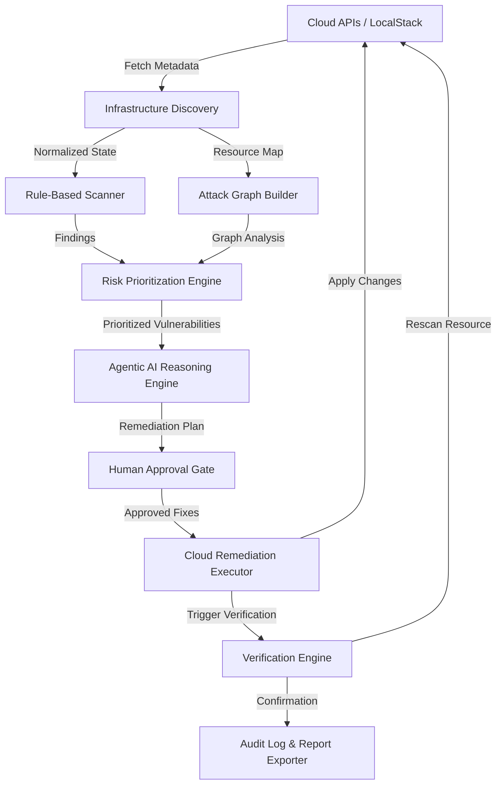

# Software Requirements Specification (SRS)

## CloudSec-Copilot
### A Context-Aware Agentic Framework for Cloud Security Posture Optimization using Attack Graphs and Verified Autonomous Remediation

---

## 1. System Overview
CloudSec-Copilot is a developer-centric, CLI-first cloud security posture management and remediation tool. It automates infrastructure discovery, rule-based scanning, attack graph construction, risk prioritization, LLM-based reasoning, human-in-the-loop remediation, and automated verification.

---

## 2. Functional Requirements

| ID | Requirement | Description | Priority |
| --- | --- | --- | --- |
| **FR1** | Discover AWS resources | Collect metadata from S3, Security Groups, IAM, RDS, EC2, and VPC. | High |
| **FR2** | Detect public S3 buckets | Rule-based detection of unencrypted or publicly accessible S3 buckets. | High |
| **FR3** | Detect open security groups | Rule-based identification of Security Groups allowing `0.0.0.0/0` ingress. | High |
| **FR4** | Build attack graph | Construct dependency and vulnerability flow graphs using NetworkX. | High |
| **FR5** | Generate AI explanation | Produce natural-language explanations of risks, attack paths, and business impact. | High |
| **FR6** | Generate remediation commands | Output executable Boto3 actions and AWS CLI commands to remediate findings. | High |
| **FR7** | Require user approval | Enforce explicit user confirmation before executing any cloud mutation. | High |
| **FR8** | Execute remediation | Safely apply cloud resource modifications via Boto3. | Medium |
| **FR9** | Verify remediation | Rescan the modified target resource to confirm vulnerability resolution. | High |
| **FR10** | Export scan report | Generate JSON/HTML security audit reports. | Medium |

---

## 3. Non-Functional Requirements

- **Response Time:** Scan & risk calculation response time < 10 seconds for demo/test environments.
- **Offline Capability:** Supports local execution via LocalStack and offline LLMs via Ollama (Llama 3 / Mistral).
- **Read-Only Default:** Runs in read-only scan mode by default; mutations require explicit flag and interactive confirmation.
- **Cross-Platform Support:** Compatible with macOS and Linux environments.
- **CLI-First UX:** Rich, terminal-native output powered by Click and Rich styling libraries.

---

## 4. Module Decomposition

```text
cloudsec_copilot/
│
├── cli/              # CLI entry point and argument parsing (Click + Rich UI)
├── discovery/        # Infrastructure metadata collector (Boto3 integration)
├── scanner/          # Rule-based deterministic vulnerability scanner
├── graph/            # NetworkX attack graph builder & path analysis
├── risk/             # Graph-based risk scoring and blast radius calculation
├── ai/               # Agentic reasoning engine (Ollama / Gemini integration)
├── remediation/      # Fix plan generator & approval gate
├── executor/         # Cloud remediation executor (Boto3 mutation)
├── verifier/         # Post-remediation rescan & verification engine
├── reports/          # Report exporter (JSON / Markdown / HTML)
├── schemas/          # Data contract JSON schema definitions
├── tests/            # Test suite (pytest)
└── utils/            # Shared utilities and logging configuration
```

---

## 5. System Architecture Diagram



---

## 6. Data Contracts (JSON Schemas)

1. `infra_state.json` - Raw & normalized resource metadata snapshot.
2. `vulnerabilities.json` - Scanner findings and rule evaluation results.
3. `risk_report.json` - Composite risk scores and attack graph path metrics.
4. `ai_response.json` - Natural-language explanations and proposed remediation steps.
5. `audit_log.json` - Complete execution trail for human approvals, remediation, and verification status.

---

## 7. CLI Specification

### `cloudsec scan`
Executes infrastructure discovery, vulnerability scanning, attack graph generation, and AI risk analysis.

### `cloudsec scan --discover-only`
Runs discovery engine only and outputs normalized `infra_state.json`.

### `cloudsec fix --id <VULN_ID>`
Presents the AI remediation plan for the specified vulnerability ID, asks for user confirmation, executes the fix, and runs post-fix verification.

### `cloudsec verify`
Runs verification checks against all previously remediated vulnerabilities.

### `cloudsec report --format json`
Exports the latest scan, risk analysis, and audit log into a structured JSON report.
